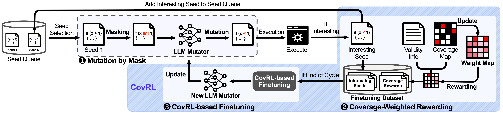

# CovRL-Fuzz

## Overview
CovRL-Fuzz is a prototype tool for a method that integrates LLMs with coverage feedback through reinforcement learning, utilizing TF-IDF. This tool was developed for the paper titled "Fuzzing JavaScript Interpreters with Coverage-Guided Reinforcement Learning for LLM-Based Mutation" which has been accepted to ISSTA 2024 ([here](https://dl.acm.org/doi/10.1145/3650212.3680389)). The CovRL-Fuzz workflow consists of three main steps, as follows:

1. Initially, CovRL-Fuzz selects a seed from the queue, applies LLM-based mutation by masking specific tokens, and predicts new test cases using a masked language model.
2. If a test case uncovers new coverage, it’s added to the seed queue. CovRL-Fuzz utilizes coverage maps and test case validity, penalizing syntax or semantic errors, and applies coverage-based rewards to guide further mutations.
3. After each mutation cycle, the LLM-based mutator is fine-tuned using PPO reinforcement learning, focusing on avoiding syntax/semantic errors and finding new coverage.

## Appendix
See [appendix](doc/appendix.pdf).

## Tested Environment
Our setup included a 64-bit Ubuntu 20.04 LTS OS on an Intel(R) Xeon(R) Gold 6134 CPU @ 3.20GHz (64-core) and NVIDIA GeoForce RTX 3090 GPU. 

## Installation
CovRL-Fuzz can run on JavaScript interpreters as far as we know. To set up the CovRL-Fuzz environment, run the following commands.

### Build AFL
CovRL-Fuzz is implemented based on token-level AFL. To get CovRL-Fuzz working, please build the modified token-level AFL.
```
cd /path_to_AFL/
make
```

### Build Interpreter
Testing with CovRL-Fuzz involves instrumenting your program with AFL. Execute the following command to build the target interpreter. 
```
export CC=/path_to_AFL/afl-clang
export CXX=/path_to_AFL/afl-clang++
execute_build_script_with_CC_CXX 
```

### Install requirements
```
pip install -r requirements.txt
```

## Preprocessing
Before running CovRL-Fuzz, you need to perfrom preprocessing.

### Configure config.json
- Specify the input directory path for `testsuites`
- Specify the output directory path for `save_dir` to store results

```
{
  "testsuites": ["path_to_testsuite"],
  "save_dir": "path_to_save",
  ...
}
```

### Run preprocessing
To preprocess the dataset, run:
```
python preprocess_dataset.py --config [path_to_config]
```

### Preprocessing Outputs
CovRL-Fuzz uses the following files, as specified in `config.json`, for fuzzing or fine-tuning:
- `testsuites` : Encoded seed directory
- `train_dataset.json` : Configuration file for the dataset used during training


## Run CovRL-Fuzz

In one terminal, please run the following module. This module performs mutation and CovRL-based fine-tuning with the LLM-based mutator.
```
python do_covrl.py \
    --config ./config/sample_config.json \
    --port 1111 \
    --model_path Salesforce/codet5p-220m \
    --predict_path path_to_fuzz_dir
```
In another terminal, please run the fuzzing module. This module operates using coverage-guided fuzzing, without performing mutation.
```
PORT=1111 VOCAB_SIZE=llm_vocab_size ./AFL/afl-fuzz -t 1000 -a 1 -m none -i path_to_seed_dir -o path_to_fuzz_dir path_to_interpreter_binary_file @@ 
```

## Citation
```
@inproceedings{eom2024covrl,
  title={{Fuzzing JavaScript Interpreters with Coverage-Guided Reinforcement Learning for LLM-Based Mutation}},
  author={Eom, Jueon and Jeong, Seyeon and Kwon, Taekyoung}
  booktitle={Proceedings of the 33rd ACM SIGSOFT International Symposium on Software Testing and Analysis (ISSTA)},
  year=2024,
}
```
